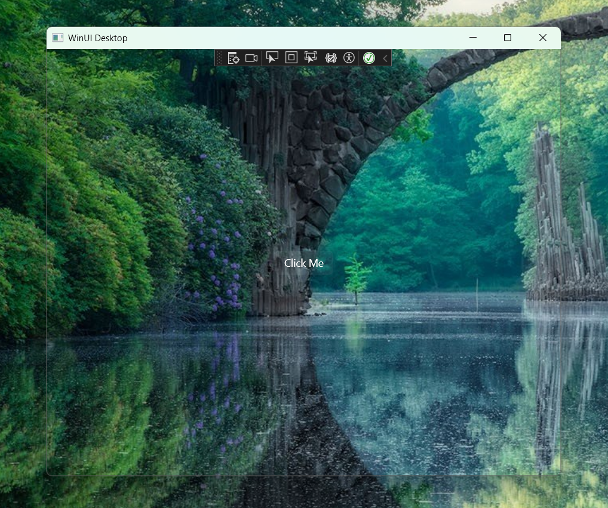

# Winui3 透明背景

WinUI3的窗口背景有两层，一层是Win32窗口的背景，一层是DesktopWindowXamlSource中Visual的背景。

去除Win32窗口背景的方式有很多，这里参考了[castorix/WinUI3_Transparent](https://github.com/castorix/WinUI3_Transparent)的方案

去除Visual背景的方式，是通过ICompositionSupportsSystemBackdrop接口设置一个透明画刷，此时框架会自动移除黑底。

